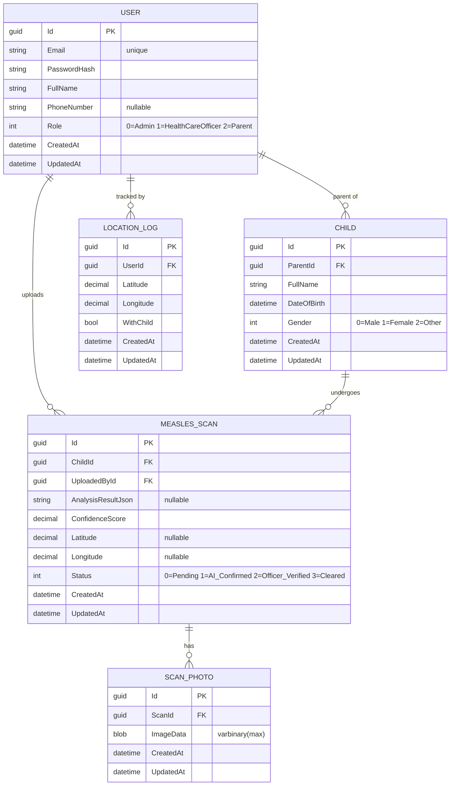

# MobroAI

AI-powered child health monitoring platform — measles triage, GPS tracking, and outbreak surveillance.

## Stack

| Layer | Technology |
|-------|------------|
| Mobile | React Native (Expo), Expo Router, Zustand, Axios |
| API | ASP.NET Core 10 Minimal API, EF Core, SQL Server |
| Auth | JWT Bearer (24 h expiry), BCrypt |

## Repo Layout

```
MobroAI/
├── apps/mobile/    React Native (Expo)
└── apps/api/       ASP.NET Core 10 Minimal API
```

## Architecture

```
┌──────────────────────┐      HTTPS / JWT      ┌──────────────────────┐
│    Mobile (Expo)     │ ───────────────────▶  │    API (.NET 10)     │
│                      │                       │                      │
│  Expo Router         │                       │  Minimal API         │
│  Zustand (auth)      │                       │  EF Core + SQL Svr   │
│  expo-location       │                       │  JWT Bearer Auth     │
└──────────────────────┘                       └──────────────────────┘
```

**API request flow:**
```
Program.cs  →  Endpoints/*.cs (MapGroup)  →  AppDbContext (EF Core)
```

---

## Quick Start

### 1. API

Create `apps/api/appsettings.Development.json` (gitignored):

```json
{
  "ConnectionStrings": {
    "DefaultConnection": "Server=YOUR_SERVER\\SQLEXPRESS;Database=MorboLens;Trusted_Connection=True;TrustServerCertificate=True"
  },
  "Jwt": {
    "Key": "YOUR_SECRET_KEY_MIN_32_CHARS",
    "Issuer": "MobroLens",
    "Audience": "MobroLensApp"
  }
}
```

```sh
cd apps/api
dotnet ef database update
dotnet run                    # http://localhost:5009
```

### 2. Mobile

```sh
cd apps/mobile
npm install
npx expo start                # scan QR with Expo Go
```

Set `EXPO_PUBLIC_API_URL` in `apps/mobile/.env.local` to point at your API.

---

## Database Schema



---

## API Reference

Base URL: `http://localhost:5009`. Protected routes require `Authorization: Bearer <token>`.

### Auth — `/auth` (no token required)

| Method | Path | Body | Description |
|--------|------|------|-------------|
| POST | `/auth/register` | `{ email, password, fullName, phoneNumber?, role }` | Register |
| POST | `/auth/login` | `{ identifier, password }` | Login → `{ accessToken, user }` |
| POST | `/auth/forgot-password` | `{ identifier }` | Request reset code |
| POST | `/auth/reset-password` | `{ identifier, code, newPassword }` | Reset password |

> `identifier` accepts email or phone number.

### Users — `/users`

| Method | Path | Auth | Body | Description |
|--------|------|:----:|------|-------------|
| POST | `/users` | | `User` JSON | Create user |
| GET | `/users` | | — | List all users |
| GET | `/users/{id}` | | — | Get user |
| PUT | `/users/{id}` | ✓ | `User` JSON | Update user |
| DELETE | `/users/{id}` | ✓ | — | Delete user |
| POST | `/users/change-password` | ✓ | `{ newPassword, confirmPassword }` | Change password |

### Children — `/children` (all require auth)

| Method | Path | Body | Description |
|--------|------|------|-------------|
| POST | `/children` | `{ parentId, fullName, dateOfBirth, gender }` | Register child |
| GET | `/children` | — | List all |
| GET | `/children/{id}` | — | Get by ID |
| GET | `/children/parent/{parentId}` | — | Get by parent |
| PUT | `/children/{id}` | `Child` JSON | Update |
| DELETE | `/children/{id}` | — | Delete |

### Measles Scans — `/scans` (all require auth)

| Method | Path | Content-Type | Body | Description |
|--------|------|-------------|------|-------------|
| POST | `/scans` | JSON | `{ childId, latitude?, longitude? }` | Create scan |
| POST | `/scans/upload` | multipart | `file, childId, latitude?, longitude?` | Create scan + photo (recommended) |
| GET | `/scans` | — | — | List all |
| GET | `/scans/{id}` | — | — | Get by ID |
| GET | `/scans/child/{childId}` | — | — | By child |
| GET | `/scans/user/{userId}` | — | — | By uploader |
| PUT | `/scans/{id}/status` | JSON | `ScanStatus` (int) | Update status |
| POST | `/scans/{id}/photos` | multipart | `file` | Add photo to existing scan |
| GET | `/scans/{id}/photos` | — | — | List photos |

> `uploadedById` is auto-populated from the JWT — do not send it.

**React Native upload example:**
```js
const form = new FormData();
form.append('file', { uri: imageUri, name: 'scan.jpg', type: 'image/jpeg' });
form.append('childId', childId);
form.append('latitude', String(latitude));
form.append('longitude', String(longitude));

fetch(`${API_BASE}/scans/upload`, {
  method: 'POST',
  headers: { Authorization: `Bearer ${token}` },
  body: form,
});
```

### Location Logs — `/locations` (all require auth)

| Method | Path | Body | Description |
|--------|------|------|-------------|
| POST | `/locations` | `{ latitude, longitude, withChild? }` | Save location |
| GET | `/locations` | — | List all |
| GET | `/locations/user/{userId}` | — | By user |

> `userId` is auto-populated from the JWT — do not send it.

---

## Enums

| Enum | Values |
|------|--------|
| `Role` | `Admin = 0` · `HealthCareOfficer = 1` · `Parent = 2` |
| `ScanStatus` | `Pending = 0` · `AI_Confirmed = 1` · `Officer_Verified = 2` · `Cleared = 3` |
| `Gender` | `Male = 0` · `Female = 1` · `Other = 2` |

---

## Notes

- Forgot-password uses hardcoded code `"12345"` — not production-ready
- `ScanPhoto.ImageData` stores raw binary (VARBINARY MAX) — large payloads go through EF
- CORS currently allows all origins/methods/headers
- Dev database: `SHANTOTUF\SQLEXPRESS` / `MorboLens` / Windows auth
