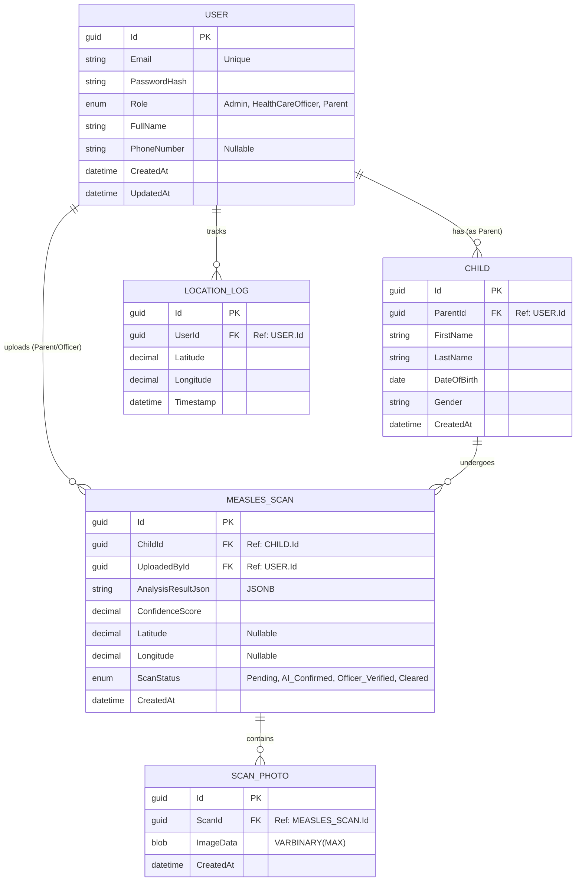

# 🧬 MorboLens: AI-Powered Measles Triage & Surveillance

**MorboLens** is an AI-driven, multimodal epidemiological platform designed to bridge the diagnostic gap for Measles in developing regions. It leverages smartphone-based computer vision and clinical symptom checking to provide rapid triage, while generating real-time, privacy-safe geospatial outbreak maps for public health officials.

---

## 🚀 Key Features

### 🩺 For Patients & Parents
* **Visual AI Triage:** Upload photos of skin rashes or oral symptoms for instant AI evaluation, returning an easy-to-understand Risk Level (Low/Medium/High).
* **Multimodal Symptom Checker:** Enhances AI accuracy by cross-referencing visual data with the clinical "3 C's" (Cough, Coryza, Conjunctivitis) and fever timelines.
* **Proactive Vaccination Tracker:** Maintains a digital profile for the user, logging MMR doses and sending automated push notifications for upcoming vaccination schedules to support community herd immunity.

### 🌐 For Public Health & Administration
* **Real-Time Geospatial Heatmaps:** High-risk cases are mapped instantly, providing administrators with live visualization of transmission clusters and outbreak vectors.
* **Geofenced Outbreak Alerts:** Automated push notifications warn users if a sudden spike in measles cases is detected in their immediate vicinity.
* **Automated Data Anonymization:** A strict privacy pipeline strips all Personally Identifiable Information (PII) before data is mapped or stored, ensuring total patient confidentiality and HIPAA-style compliance.
* **Research Dataset Export:** Administrators can export clean, anonymized clinical datasets and images to support academic research and continuous AI model retraining.

---

## 🛠️ Technology Stack
* **Backend API:** .NET Minimal APIs (C#)
* **AI/Vision Engine:** [Add your ML framework here, e.g., OpenCV / Python / ONNX]
* **Database:** [Add your database, e.g., SQL Server / PostgreSQL]
* **Frontend:** [Add your frontend tech, e.g., Blazor / React / Flutter]

---

## 🔒 Privacy First
MorboLens is built with security at its core. The system features comprehensive role-based access control (RBAC) and audit logging to track exactly who accesses or modifies medical records, protecting sensitive data at every step.

---

## 📊 Database Schema

