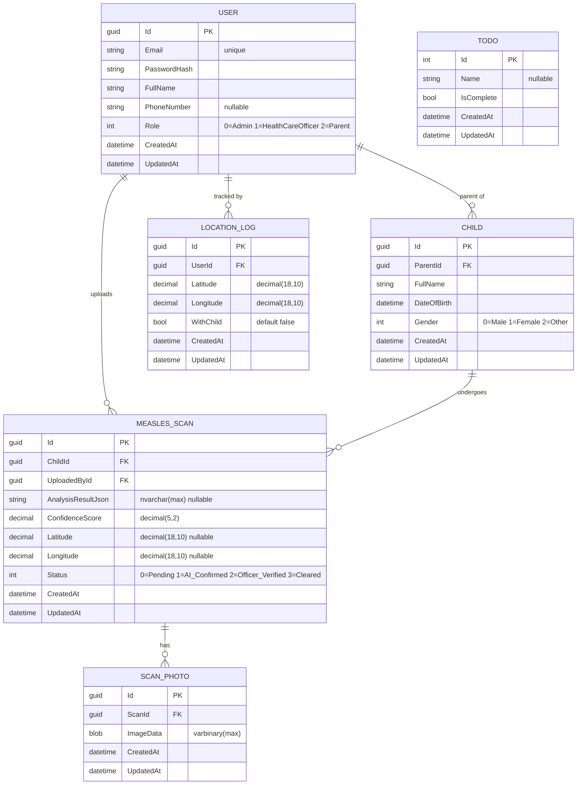

# MorboLens: AI-Powered Measles Triage & Surveillance

**MorboLens** is an AI-driven, multimodal epidemiological platform designed to bridge the diagnostic gap for Measles in developing regions. It leverages smartphone-based computer vision and clinical symptom checking to provide rapid triage, while generating real-time, privacy-safe geospatial outbreak maps for public health officials.

---

## Key Features

### For Patients & Parents
- **Visual AI Triage:** Upload photos of skin rashes or oral symptoms for instant AI evaluation, returning an easy-to-understand Risk Level (Low/Medium/High).
- **Multimodal Symptom Checker:** Enhances AI accuracy by cross-referencing visual data with the clinical "3 C's" (Cough, Coryza, Conjunctivitis) and fever timelines.
- **Proactive Vaccination Tracker:** Maintains a digital profile for the user, logging MMR doses and sending automated push notifications for upcoming vaccination schedules to support community herd immunity.

### For Public Health & Administration
- **Real-Time Geospatial Heatmaps:** High-risk cases are mapped instantly, providing administrators with live visualization of transmission clusters and outbreak vectors.
- **Geofenced Outbreak Alerts:** Automated push notifications warn users if a sudden spike in measles cases is detected in their immediate vicinity.
- **Automated Data Anonymization:** A strict privacy pipeline strips all Personally Identifiable Information (PII) before data is mapped or stored.
- **Research Dataset Export:** Administrators can export clean, anonymized clinical datasets and images to support academic research and continuous AI model retraining.

---

## Technology Stack

| Layer | Technology |
|---|---|
| Backend API | .NET 10 Minimal APIs (C#) |
| Database | SQL Server (SQLEXPRESS) |
| ORM | Entity Framework Core 10 |
| Auth | JWT Bearer tokens (BCrypt password hashing) |
| Mobile Frontend | React Native |
| AI/Vision Engine | Python (integrated via API) |

---

## Architecture

Single .NET 10 Minimal API project — no Controllers. All routes are defined as extension methods in `Endpoints/` and registered in `Program.cs`.

```
Request → Program.cs (middleware + route registration)
        → Endpoints/*.cs (grouped route handlers via MapGroup)
        → AppDbContext (EF Core, injected directly into handler delegates)
```

**Directory layout:**

```
Endpoints/      — one file per domain (Auth, User, Child, MeaslesScan, LocationLog, Todo)
Models/         — EF entities + DTOs (AuthModels.cs) + enums (Common.cs)
Services/       — ITokenService / TokenService (JWT generation)
AppDbContext.cs — 6 DbSets
Program.cs      — service registration + endpoint mapping
```

---

## Running Locally

```bash
dotnet run                              # HTTP on port 5009
dotnet build
dotnet ef migrations add <Name>         # add EF Core migration
dotnet ef database update               # apply migrations
```

> Database: `SHANTOTUF\SQLEXPRESS`, database name `MorboLens`, Windows auth.
> Local config overrides go in `appsettings.Development.json` (git-ignored).

---

## Database Schema



---

## Enums

| Enum | Values |
|---|---|
| `Role` | `Admin = 0`, `HealthCareOfficer = 1`, `Parent = 2` |
| `ScanStatus` | `Pending = 0`, `AI_Confirmed = 1`, `Officer_Verified = 2`, `Cleared = 3` |
| `Gender` | `Male = 0`, `Female = 1`, `Other = 2` |

---

## API Reference

All endpoints that require a token use `Authorization: Bearer <token>`.

### Auth — `/auth` (no auth required)

| Method | Path | Body | Description |
|---|---|---|---|
| POST | `/auth/register` | `{ email, password, fullName, phoneNumber?, role }` | Register new user |
| POST | `/auth/login` | `{ identifier, password }` | Login — returns `{ accessToken, user }` |
| POST | `/auth/forgot-password` | `{ identifier }` | Request password reset code |
| POST | `/auth/reset-password` | `{ identifier, code, newPassword }` | Reset password with code |

> `identifier` accepts email or phone number.

---

### Users — `/users`

| Method | Path | Auth | Body | Description |
|---|---|---|---|---|
| POST | `/users` | — | `User` JSON | Create user (raw, hashes password) |
| GET | `/users` | — | — | List all users (returns UserDto) |
| GET | `/users/{id}` | — | — | Get user by ID |
| PUT | `/users/{id}` | Required | `User` JSON | Update user profile |
| DELETE | `/users/{id}` | Required | — | Delete user |
| POST | `/users/change-password` | Required | `{ newPassword, confirmPassword }` | Change own password |

---

### Children — `/children` (all require auth)

| Method | Path | Body | Description |
|---|---|---|---|
| POST | `/children` | `{ parentId, fullName, dateOfBirth, gender }` | Register a child |
| GET | `/children` | — | List all children |
| GET | `/children/{id}` | — | Get child by ID |
| GET | `/children/parent/{parentId}` | — | Get children by parent |
| PUT | `/children/{id}` | `Child` JSON | Update child |
| DELETE | `/children/{id}` | — | Delete child |

---

### Measles Scans — `/scans` (all require auth)

| Method | Path | Content-Type | Body / Form Fields | Description |
|---|---|---|---|---|
| POST | `/scans` | `application/json` | `{ childId, latitude?, longitude? }` | Create scan (no photo) |
| POST | `/scans/upload` | `multipart/form-data` | `file`, `childId`, `latitude?`, `longitude?` | Create scan + photo atomically |
| GET | `/scans` | — | — | List all scans |
| GET | `/scans/{id}` | — | — | Get scan by ID |
| GET | `/scans/child/{childId}` | — | — | Get scans for a child |
| GET | `/scans/user/{userId}` | — | — | Get scans by uploader |
| PUT | `/scans/{id}/status` | `application/json` | `ScanStatus` (int) | Update scan status |
| POST | `/scans/{id}/photos` | `multipart/form-data` | `file` | Add photo to existing scan |
| GET | `/scans/{id}/photos` | — | — | Get all photos for a scan |

> `uploadedById` is auto-populated from the JWT — do not send it in the request.
>
> `POST /scans/upload` is the recommended mobile endpoint: creates scan + photo + saves location in one atomic call.

**React Native example:**
```js
const form = new FormData();
form.append('file', { uri: imageUri, name: 'scan.jpg', type: 'image/jpeg' });
form.append('childId', childId);
form.append('latitude', String(latitude));
form.append('longitude', String(longitude));

fetch(`${API_BASE}/scans/upload`, {
  method: 'POST',
  headers: { Authorization: `Bearer ${token}` },
  body: form,
});
```

---

### Location Logs — `/locations` (all require auth)

| Method | Path | Body | Description |
|---|---|---|---|
| POST | `/locations` | `{ latitude, longitude, withChild? }` | Save current location |
| GET | `/locations` | — | List all location logs |
| GET | `/locations/user/{userId}` | — | Get logs for a user |

> `userId` is auto-populated from the JWT — do not send it in the request.

---

## Auth Details

- JWT configured in `appsettings.json` under `Jwt:Key`, `Jwt:Issuer`, `Jwt:Audience`
- Tokens expire in **24 hours**
- Passwords hashed with **BCrypt**
- Login accepts email **or** phone number as `identifier`
- Forgot-password flow uses a hardcoded code (`"12345"`) — not production-ready

---

## Privacy

MorboLens is built with security at its core. The system features comprehensive role-based access control (RBAC) with three roles (Admin, HealthCareOfficer, Parent) and audit logging to track exactly who accesses or modifies medical records.
